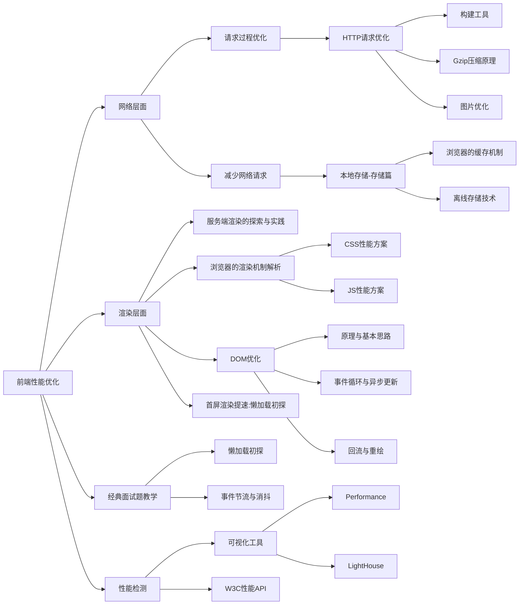
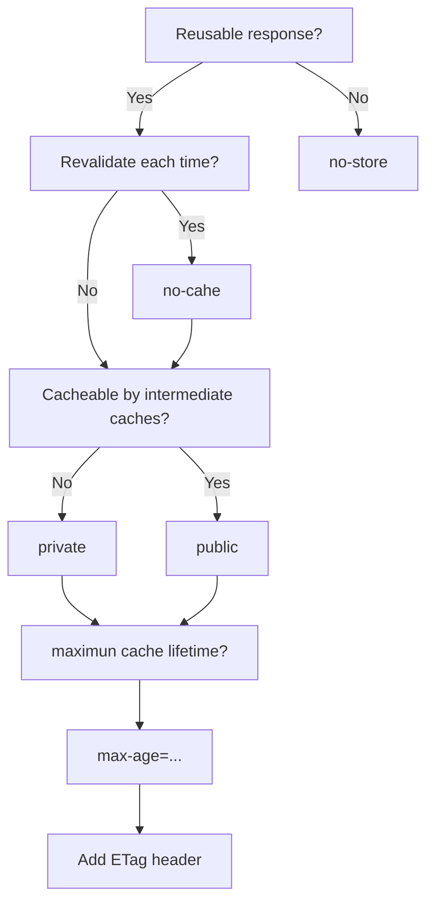

# 前端性能优化原理与实践

## 知识体系：从一道面试题说起

> 从输入URL到页面加载完成，发生了什么？

首先我们需要通过 DNS 域名解析系统将 URL 解析为对应的 IP 地址，然后与这个 IP 地址确定的那台服务器建立起 TCP 网络连接，随后我们向服务端抛出我们的 HTTP 请求，服务端处理完我们的请求之后，把目标数据放在 HTTP 响应里返回给客户端，拿到响应数据的浏览器就可以开始走一个渲染的流程。渲染完毕，页面便会呈现给用户，并时刻等待响应用户的操作。

这个过程切分为如下的过程片段：

1. DNS 解析
2. TCP 连接 
3. HTTP 请求抛出
4. 服务端处理请求，HTTP 响应返回
5. 浏览器拿到响应数据，解析响应内容，把解析的结构展示给用户



## 网络篇：webpack 性能调优与Gzip原理

从输入 URL 到显示页面的过程中，涉及到网络层面的有三个过程：

- DNS 解析
- TCP 连接 
- HTTP 请求/响应

对于前两者前端可以做的努力比较少，相比之下，HTTP 连接层面的优化才是网络优化的核心。HTTP优化有两个大的方向：

- 减少请求的次数
- 减少单次请求所花费的时间

这两个优化点指向日常开发的常见操作——资源的压缩与合并，与时下最主流的构建webpack息息相关。

### webpack的性能瓶颈

主要是两个方面：

- webpack的构建过程太花时间
- webpack的打包结果体积太大

### webpack优化方案——构建过程提速策略

#### 不要让 loader做太多的事情——以babel-loader为例子

babel-loader很强大但是也很慢，最常见的优化方式用 include 或者 exclude 来帮我们避免不必要的转译，比如webpack 官方介绍babel-loader时出的示例：

```javascript
module:{
    rules:[
        {
            test: /\.js$/,
            exclude: /(node_modules|bower_components)/,
            use: {
                loader: 'babel-loader',
                options: {
                    presets: ['@babel/preset-env']
                }
            }
        }
    ]
}
```

这段代码使得我们规避了对庞大的 node_modules 文件夹或是 brower_components 文件夹的处理。但通过限定文件范围带来的性能提升是有限的。除此之外，如果我们萱蕚开启缓存将转译结果缓存至文件系统，则至少可以将 babel-loader 的工作效率提高两倍。只需要为 loader 增加相应的参数设定：

```javascript
loader: 'babel-loader?cacheDirectory=true'
```

优化范围不单单是 loaders，像一些类似 UglifyJsPlugin 的 webpack 插件在工作时依然会被庞大的第三方库拖累，webpack构建速度依然会因此大打折扣，所以针对这些庞大的第三方库，我们还需要做一些额外的努力。

#### 不要放过第三方库

第三库以 node_modules 为代表，它们庞大得可怕都又不可缺。

处理第三方库的方法有很多，其中 Externals 不够聪明，一些情况下会引发重复打包的问题，CommonsChunkPlugin 每次构建都会重新构建一次 vendor,处于效率的考虑，推荐使用 DllPlugin

DllPlugin是基于Windows 动态链接库 dll 的思想被创作出来的，这个插件会把第三方库单独打包到一个文件中，这个文件就是一个单纯的依赖库，这个依赖库不会跟着你的业务代码一起被重新打包，只有当依赖自身发生版本变化时才会重新打包。

使用DllPlugin处理文件要分两步走：

- 基于 dll 专属的配置文件，打包 dll 库
- 基于 webpack.config.js 文件 打包业务代码

以一个基于 React 的简单项目为例子，我们的 dll 的配置文件可以如下编写：

```javascript
const path = require('path');
const webpack = require('webpack');

module.exports = {
    entry:{
        // 依赖的库数组
        vendor:[
            'prop-types',
            'babel-polyfill',
            'react',
            'react-dom',
            'react-router-dom',
        ],        
    },
    output:{
        path: path.join(__dirname, 'dist'),
        filename: '[name].js',
        library: '[name]_[hash]',
    },
    plugins:[
        new webpack.DllPlugins({
            // DllPlugin的name属性需要和libary保持一致
            name: '[name]_[hash]',
            path: path.join(__dirname,'dist','[name]-manifest.json'),
            // context 需要和webpack.config.js 保持一致
            context: __dirname
        })
    ]
}
```

编写完成后，运行这个配置文件，dist文件夹会出现这两个文件：

```shell
vendor-manifest.json
vendor.js
```

vendor.js是我们第三方库打包的结果，多出来的 vendor-manifest.json则用于描述每个第三方库对应的具体路径：

```javascript
{
  "name": "vendor_397f9e25e49947b8675d",
  "content": {
    "./node_modules/core-js/modules/_export.js": {
      "id": 0,
        "buildMeta": {
        "providedExports": true
      }
    },
    "./node_modules/prop-types/index.js": {
      "id": 1,
        "buildMeta": {
        "providedExports": true
      }
    },
    ...
  }
}  
```

随后子阿webpack.config.js里面针对 dll稍作配置：

```javascript
const path = require('path');
const webpack = require('webpack');
module.exports = {
    mode: 'production',
    // 编译入口
    netry: {
        main: './src/index.js'
    },
    // 目标文件
    output: {
        path: path.join(__dirname, 'dist/'),
        filename: '[name].js'
    },
    // dll相关配置
    plugins: [
        new webpack.DllReferencePlugin({
            context: __dirname,
            // mainfest 就是我们第一步中打包出来的 json文件
            manifest: require('./dist/verdor-manifest.json')
        })
    ]
}
```

一次基于 dll 的webpack 构建过程优化便大功告成！

#### Happypack——将 loader 由单进程转为多进程

webpack是单进程，就算此刻存在多个任务，也只能排队一个接一个等待处理。而 CPU 是多核的，Happypack 会冲锋释放 CPU 在多核并发方面的优势，帮我们把任务分解给多个子进程去并发执行，大大提升打包效率

Happypack 的使用方式也简单，只需要把 loader 的配置转移到 Happypack 中去即可：

```javascript
const HappyPack = require('happypack');
// 手动创建进程池
const happyThreadPool = HappyPack.ThreadPool({size: os.cpus().length});

module.exports = {
    module:{
        rules: [
            // ...
            {
                test:/\.js$/,
                // 问号后面的咨询参数指定了处理这类文件的 HappyPack的实例的名字
                loader: 'happypack/loader?id=happyBabel',
                // ...
            }
        ]
    },
    plugins: [
        new HappyPack({
            // 这个 HappyPack 的名字叫做 happyBabel,和楼上的咨询参数相呼应
            id: 'happyBabel',
            threadPool: happyThreadPool,
            loaders: ['babel-loader?cacheDirectory']
        })
    ]
}
```

### webpack优化方案——构建结果体积压缩

#### 文件结构可视化，找出导致体积过大的原因

`webpack-bundle-analyzer` 配置方法和普通的plugin无异，会以矩形树图的形式将包含各个模块的大小和依赖关系呈现出来。

使用时只需要将其以插件的形式引入：

```javascript
const BundleAnalyzerPlugin = require('webpack-bundle-analyzer').BundleAnalyzerPlugin;
module.exports = {
    plugins: [
        new BundleAnalyzerPlugin()
    ]
}
```


#### 拆分资源

还是围绕 DllPlugin展开

#### 删除冗余代码

`Tree-Shaking`

从 webpack2 开始，webpack原生支持了 ES6 的模块系统，并基于此推出了 Tree-Shaking.

> Tree shaking is a term commonly used in the JavaScript context for dead-code elimination,or more precisely,live-code import.It relies on ES2015 module import/export for the static structure of its module system

意思是基于 import/export 语法，Tree-Shaking 可以在编译的过程中获悉哪些模块并没有真正被使用，这些没用的代码，在最后打包的时候会被去除。

举个例子，主干文件：

```javascript
import { page1, page2 } from './pages';

// show 是事先实现的函数，用来展示页面
show(page1);

// pages文件里面，导出了两个页面：
export const page1 = xxx;
export const page2 = xxx;

// 但是因为page2 事实上并没有被用到，这个没有被用到的情况在静态分析的过程中是可以被感知出来的，所以打包的结果把这部分：
export const page2 = xxx;
// 直接删掉，这就是Tree-shaking 做的事情
```

Tree-Shaking 的针对性很强，更适合用来处理模块级别的冗余代码，至于粒度更细的冗余代码的去除，往往需要被整合进 JS 或者 CSS 的压缩和分离的过程中。

以 UglifyJsPlugin为例子，看一下如何在压缩过程中对碎片化的冗余代码，例如console语句、注释等进行自动化删除：

```javascript
const UglifyJsPlugin = require('uglifyjs-webpack-plugin');
module.exports = {
    plugins: [
        new UglifyJsPlugin({
            // 运行并发
            parallel: true,
            // 开启缓存
            cache: true,
            compress: {
                // 删除所有console语句
                drop_console: true,
                // 把使用多次的静态值自动定义为变量
                reduce_vars: true,
            },
            output:{
                // 不保留注释
                comment: false,
                // 使输出的代码尽可能紧凑
                beautify: false
            }
        })
    ]
}
```

上面的代码手动引入 UglifyJsPlugin其实是webpack3的用法，webpack4已经默认使用 uglifyjs-webpack-plugin对代码进行压缩了，在webpack4中，我们是通过配置 optimization.minimize 与 optimization.minimizer来自定义压缩相关的操作。

#### 按需加载

React构建单页应用，用React-router 来控制路由，十个路由对应了十个页面，然后这十个页面都不简单，如果把整个项目打一个包，用户打开我的网站时，会有几率卡死。更好的做法是先给用户展示主页，其他页面等到了请求到了再加载。

- 一次不加载完所有的文件内容，只加载此刻需要用到的那部分，提前做拆分
- 当需要更多的内容。再对用到的内容进行即时加载

假设一个Router对应的组件叫做 BugComponent，webpack的按需加载：

```javascript
// 原始代码
import BugComponent from '../pages/BugComponent';
<Router path='/bug' component={BugComponent}>

// 按需加载
// webpack配置
{
    output:{
        path: path.join(__dirname,'/../dist'),
        filename: 'app.js',
        publicPath: defaultSettings.publicPath,
        // 指定 chunkFilename
        chunkFilename: '[name].[chunkhash:5].chunk.js'
    }
}
// 路由代码
const getComponent =>(location, cb) = require.ensure([],(require)=>{
    cb(null,require('../page/BugComponent').default)
},'bug')
<Router path='/bug' component={getComponent}>    
```

核心就是下面的方法：

````javascript
require.ensure(dependencies, callback, chunkName);
````

这是一个异步的方法，webpack在打包时，BugComponent会被单独打包成一个文件，只有在我们跳转bug这个路由的时候，这个异步方法的回调才会生效，才会真正地去获取 BugComponent 的内容，这就是按需加载

按需加载的粒度，还可以继续细化，细化到更小的组件，细化到某个功能点上。

React-Router4中使用 Code-Splitting 替换了上面的操作，里面的 Bundle-Loader也是使用了 require.ensure来实现的。

#### Gzip压缩原理

在 request headers 加上这么一句

```makefile
accept-encoding: gzip
```

> HTTP 压缩是一种内置到网页服务器和网页客户端中以改进运输速度和带宽利用率的方式。在使用 HTTP 压缩的情况下，HTTP 数据在从服务器发送前就已压缩：兼容的浏览器将在下载所需的格式前宣告支持何种方法给服务器；不支持压缩方法的浏览器将下载未经压缩的数据。最常见的压缩方法包括 Gzip 和 Deflate

HTTP 压缩就是以缩小体积为目的，对HTTP 内容进行重新编码的过程

Gzip 的内核就是 Deflate,目前我们压缩文件用得最多的就是 Gzip，Gzip就是 HTTP 压缩的经典例题。

##### 该不该用 Gzip

如果项目不是极端的超小型文件都建议使用。

##### Gzip是万能的吗

是高效的，通常压缩后能减少响应 70% 左右的大小

但不是万能的，Gzip压缩背后的原理是在一个文本文件中找出一些重复存在的字符串、临时替换它们，从而使得整个文件变小，根据这个原理，文件中代码的重复率越高，那么压缩的效率就越高，使用 Gzip 的收益就越大，反之亦然。

##### webpack 的 Gzip 和服务端的 Gzpi

一般来说，Gzip 压缩是服务器的活：服务器了解到我们有一个 Gzip 压缩的需求，它就会启动自己的 CPU 去为我们完成这个任务。而压缩文件这个过程本身是需要耗费时间的，可以理解为以服务器的时间开销和 CPU 开销 以及浏览器解析压缩文件的开销为代价，剩下一些传输过程中的时间开销。

既然存在这样的交换，我们就需要学会权衡，服务器的性能不是无限的，如果存在大量的压缩需求，服务器也不行。服务器一旦慢下来，用户还是需要等待。webpack中Gzip 压缩操作的方式，事实上是为了在构建过程中去做一部分服务器的工作，为服务器分压。

因此这两个地方的 Gzip压缩，不能互相替代，我们需要结合业务压力的实际强度情况权衡两者。

### 小结

上述都是在讨论文件，文本文件及其构建过程的优化。一个完整的现代前端应用，除了 HTML/CSS/JS还需要借助图片来提高用户的视觉体验，而图片的优化思路、场景与措施又是另外一个故事了

## 网络篇：图片优化——质量与性能的博弈

《高性能网站建设指南》的作者 Steve Souders 曾在2013的一篇[博客](https://www.stevesouders.com/blog/2013/04/26/i/)中提到：

>我的大部分性能优化工作都集中在 JavaScript 和 CSS 上，从早期的 Move Scripts to the Bottom 和 Put Stylesheets at the Top 规则。为了强调这些规则的重要性，我甚至说过，“JS 和 CSS 是页面上最重要的部分”。
>
>几个月后，我意识到这是错误的。图片才是页面上最重要的部分。
>
>我关注 JS 和 CSS 的重点也是如何能够更快地下载图片。图片是用户可以直观看到的。他们并不会关注 JS 和 CSS。确实，JS 和 CSS 会影响图片内容的展示，尤其是会影响图片的展示方式（比如图片轮播，CSS 背景图和媒体查询）。但是我认为 JS 和 CSS 只是展示图片的方式。在页面加载的过程中，应当先让图片和文字先展示，而不是试图保证 JS 和 CSS 更快下载完成。

图片这块的优化，与其说是优化不如说是权衡，我们要做的事情是去压缩图片的体积，或者一开始就选择体积比较小的图片格式，但是这个优化操作，是以牺牲一部分成像质量为代价的，因此我们主要的任务是尽可能去寻求一个质量与性能之间的平衡点。

### 图片依然很大

[HTTP-Archive](https://link.juejin.cn/?target=https%3A%2F%2Fhttparchive.org%2Freports%2Fpage-weight%23bytesTotal) 这个网站可以定时抓取 Web上的站点，并记录资源的加载情况。从网站可以看出图片的平均体积有越来越大的趋势，图片在所有资源中的比重也比较大。

### 不同业务场景下的图片方案选型

时下应用较为广泛的Web图片格式有JPEG/JPG、PNG、WebP、Base64、SVG等，雪碧图（CSS Sprites）至今也在一些前端应用中发光发热。

#### 前置知识：二进制位数与色彩的关系

计算中，像素用二进制数来表示，不同图片格式中像素与二进制数位之间的关系是不同的，一个像素对应的二进制数位越大，它可以表示的颜色种类就越多，成像效果也就越细腻，文件体积也会相应越大。

一个二进制表示两种颜色0对应黑，1对应白，如果一种图片格式对应的二进制位数有n个，那么它就可以呈现2^n^种颜色

#### JPEG/JPG

关键字：有损压缩、体积小、加载快，不支持透明

##### 优点

JPG 的最大特点就是有损压缩，这种高效的压缩算法使它成为了一种非常轻巧的图片格式。

另一方面，即使被称为有损压缩，JPG 的压缩方式仍然是一种高质量的压缩方式：当我们把图片体积压缩到原来体积的50%以下时，JPG 仍然可以保持住60%的品质。此外，JPG 格式以24位存储单个图，可以呈现多达1699万种颜色，足以应对大多数场景下对色彩的要求，这一点决定来了它压缩前后的质量损耗并不容易被我们肉眼所察觉——前提是用对了业务场景

##### 使用场景

JPG 适合呈现色彩丰富的图片，日常开发中，经常作为大背景图、轮播图或者Banner图出现。

使用 JPG 呈现大图既可以保住图片的质量，又不会带来令人头疼的图片体积，是当下比较推崇的方案。

##### 缺陷

当处理矢量图形和Logo等线条感比较强，颜色对比强烈的图像时，人为压缩导致的图片模糊会相当明显。

此外 JPEG 图像不支持透明度处理，透明图片需要PNG来呈现

#### PNG-8 与 PNG-24

关键字：无损压缩、质量高、体积大、支持透明

##### 优点

PNG 可移植网络图形格式是一种无损压缩的高保真图片格式，8和24都是二进制数的位数，按照我们前置知识提到的对应关系，8位的 PNG 最多支持256种颜色，而24位的可以呈现约1600万种颜色。

PNG 图片具有比 JPG 更强的色彩表现力，对线条的处理更加细腻，对透明度有良好的支持，弥补了我们提到的 JPG的 局限性，唯一的BUG就是体积太大了。

##### PNG-8 与 PNG-24的选择题

当你追求最佳的显示效果，并且不在意文件体积的大小时，推荐使用 PNG-24

但实践中，为了规避体积的问题，一般不用 PNG 去处理较复杂的图像，遇到适合 PNG 的场景时，也会优先选择更为小巧的 PNG-8

PNG-8 还是 PNG-24，好的做法是把图片先按照这两种格式分别输出，看 PNG-8 输出的结果是否会带来肉眼可见的质量损耗，并且确认这种损耗是否在 UI 设计的可接受范围内，基于对比的结果去判断

##### 应用场景

PNG 在处理线条和颜色对比度方法的优势，主要用它来呈现小的 Logo、颜色简单并且对比强烈的图片或者背景。

#### SVG

关键字：文本文件、体积小、不失真、兼容性好

SVG可缩放矢量图形是一种基于XML语法的图像格式。它和文本提及的其他图片种类有着本质的不同：SVG对图像的处理不是基于像素点，而是基于对图像的形状的描述

##### 特征

文件体积更小，可压缩性更强。最显著的优势还是在于图片可无限放大而不失真这一点上，使得SVG即便是被放到视网膜屏幕上，也可以一如既往地展现出比较好的成像品质——1张SVG足以适配n种分辨率

SVG是文本文件，可以像写代码一些定义SVG,把它写在HTML里面，成为DOM的一部分，也可以把对图形的描述写入 以.svg为后缀的独立文件。

SVG的局限性主要有两个方面：一方面是它的渲染成本比较高，这点对性能来说不利，另外一方面，存在着与其他图片格式所没有的学习成本，它是可编程的

##### 使用方式与应用场景

- 写入HTML:

```html
<!DOCTYPE html>
<html lang="en">
<head>
    <meta charset="UTF-8">
    <title></title>
</head>
<body>
    <svg xmlns="http://www.w3.org/2000/svg"   width="200" height="200">
        <circle cx="50" cy="50" r="50" />
    </svg>
</body>
</html>
```

- 写入独立文件后引入HTML

```html

```

#### Base64

关键字：文本文件、依赖编码、小图标解决方案

Base64并非一种图片形式，而是一种编码方式。和雪碧图一样，是作为小图标和背景图像合并到一张图片上，然后利用CSS的背景定位来显示其中一部分的技术。

MDN对雪碧图的解释：

> 图像精灵（sprite，意为精灵），被运用于众多使用大量小图标的网页应用之上。它可取图像的一部分来使用，使得使用一个图像文件替代多个小文件成为可能。相较于一个小图标一个图像文件，单独一张图片所需的 HTTP 请求更少，对内存和带宽更加友好。

##### 理解

每次加载图片都需要单独向服务器请求这个图片对应的资源——这就意味着一次HTTP请求的开销

Base64是一种用于传输8Bit字节码的编码方式，通过对图片进行Base64编码，我们直接将编码结果写入HTML或者写入CSS,从而减少HTTP请求的次数。

举个例子：

```shell
# 放大镜的Logo
https://p1-jj.byteimg.com/tos-cn-i-t2oaga2asx/gold-user-assets/2018/9/15/165db7e94699824b~tplv-t2oaga2asx-image.image
```

加载图片：

```html

```

浏览器就会针对这个图片链接去发起一个资源请求，如果我们对图片进行Base64编码，会得到这样的一个字符串：

```shell
data:image/png;base64,iVBORw0KGgoAAAANSUhEUgAAABYAAAAWCAYAAADEtGw7AAAMJGlDQ1BJQ0MgUHJvZmlsZQAASImVlwdUU8kagOeWJCQktEAEpITeBCnSpdfQpQo2QhJIKDEkBBU7uqjgWlARwYquitjWAshiw14Wwd4fiKgo62LBhsqbFNDV89477z9n7v3yzz9/mcydMwOAehxbJMpFNQDIExaI48MCmeNT05ikR4AECIAKRgEamyMRBcTFRQEoQ+9/yrubAJG9r9nLfP3c/19Fk8uTcABA4iBncCWcPMiHAMDdOCJxAQCEXqg3m1YggkyEWQJtMUwQsrmMsxTsIeMMBUfJbRLjgyCnA6BCZbPFWQCoyfJiFnKyoB+1pZAdhVyBEHIzZF8On82F/BnyqLy8qZDVrSFbZ3znJ+sfPjOGfbLZWcOsqEUuKsECiSiXPeP/nI7/LXm50qEYZrBR+eLweFnNsnnLmRopYyrk88KMmFjIWpCvC7hyexk/4UvDk5T2HziSIDhngAEASuWygyMhG0A2FebGRCn1vpmCUBZkOPdooqCAlagYi3LFU+OV/tHpPElIwhCzxfJYMptSaU5SgNLnRj6PNeSzqYifmKLIE20rFCTHQFaDfF+SkxCptHlexA+KGbIRS+NlOcP/HAOZ4tB4hQ1mnicZqgvz4gtYMUqO4rDl+ehCnlzATwxX+MEKeZLxUUN5cnnBIYq6sGKeMEmZP1YuKgiMV47dJsqNU9pjzbzcMJneFHKrpDBhaGxfAVxsinpxICqIS1TkhmtnsyPiFHFxWxAFgkAwYAIpbBlgKsgGgtbehl74S9ETCthADLIAD9grNUMjUuQ9QvhMAEXgL0g8IBkeFyjv5YFCqP8yrFU87UGmvLdQPiIHPIGcByJBLvwtlY8SDkdLBo+hRvBTdA7MNRc2Wd9POqb6kI4YQgwmhhNDiTa4Pu6Le+NR8OkPmzPugXsO5fXNnvCE0E54RLhB6CDcmSIoFv+QORNEgw6YY6iyuozvq8MtoVdXPBD3gf6hb5yB6wN7fAyMFID7wdiuUPt9rtLhir/NpdIX2ZGMkkeQ/cnWP2Ugm53v61fq1WzVXJV5ZQzPVtCw1Y9egr6bPy58R/5oiS3GDmLnsJPYBawZawBM7DjWiF3Gjsp4eG08lq+NoWjx8txyoB/BT/HYypiyWZM41jn2OH5W9oEC3vQC2ccSNFU0QyzI4hcwA+BuzWOyhByHUUxnRye4i8r2fsXW8oYh39MRxsVvuvwTAHiWQmXWNx0b7kFHngBAf/dNZ/YaLvsVABxt40jFhQodLnsQAAWowy9FDxjBvcsaVuQM3IA38AchIALEgkSQCibDOefDdSoG08AsMB+UgDKwAqwBVWAT2Ap2gj3gAGgAzeAkOAsugTZwA9yDa6UbvAB94B0YQBCEhNAQOqKHGCMWiB3ijHggvkgIEoXEI6lIOpKFCBEpMgtZgJQh5UgVsgWpRX5HjiAnkQtIO3IH6UR6kNfIJxRDqag2aohaoqNRDzQAjUQT0UloFpqPFqEL0WVoJVqD7kbr0ZPoJfQG2oG+QPsxgKliDMwEs8c8sCAsFkvDMjExNgcrxSqwGmwv1gT/6WtYB9aLfcSJOB1n4vZwvYbjSTgHz8fn4EvxKnwnXo+fxq/hnXgf/pVAIxgQ7AheBBZhPCGLMI1QQqggbCccJpyB30434R2RSGQQrYju8NtLJWYTZxKXEjcQ9xFPENuJXcR+EomkR7Ij+ZBiSWxSAamEtI60m3ScdJXUTfqgoqpirOKsEqqSpiJUKVapUNmlckzlqspTlQGyBtmC7EWOJXPJM8jLydvITeQr5G7yAEWTYkXxoSRSsinzKZWUvZQzlPuUN6qqqqaqnqrjVAWq81QrVfernlftVP1I1aLaUoOoE6lS6jLqDuoJ6h3qGxqNZknzp6XRCmjLaLW0U7SHtA9qdDUHNZYaV22uWrVavdpVtZfqZHUL9QD1yepF6hXqB9WvqPdqkDUsNYI02BpzNKo1jmjc0ujXpGs6acZq5mku1dyleUHzmRZJy1IrRIurtVBrq9YprS46RjejB9E59AX0bfQz9G5toraVNks7W7tMe492q3afjpbOGJ1knek61TpHdToYGMOSwWLkMpYzDjBuMj6NMBwRMII3YsmIvSOujnivO1LXX5enW6q7T/eG7ic9pl6IXo7eSr0GvQf6uL6t/jj9afob9c/o947UHuk9kjOydOSBkXcNUANbg3iDmQZbDS4b9BsaGYYZigzXGZ4y7DViGPkbZRutNjpm1GNMN/Y1FhivNj5u/Jypwwxg5jIrmaeZfSYGJuEmUpMtJq0mA6ZWpkmmxab7TB+YUcw8zDLNVpu1mPWZG5tHm88yrzO/a0G28LDgW6y1OGfx3tLKMsVykWWD5TMrXSuWVZFVndV9a5q1n3W+dY31dRuijYdNjs0GmzZb1NbVlm9bbXvFDrVzsxPYbbBrH0UY5TlKOKpm1C17qn2AfaF9nX2nA8MhyqHYocHh5Wjz0WmjV44+N/qro6tjruM2x3tOWk4RTsVOTU6vnW2dOc7VztddaC6hLnNdGl1ejbEbwxuzccxtV7prtOsi1xbXL27ubmK3vW497ubu6e7r3W95aHvEeSz1OO9J8Az0nOvZ7PnRy82rwOuA19/e9t453ru8n421Gssbu21sl4+pD9tni0+HL9M33Xezb4efiR/br8bvkb+ZP9d/u//TAJuA7IDdAS8DHQPFgYcD3wd5Bc0OOhGMBYcFlwa3hmiFJIVUhTwMNQ3NCq0L7QtzDZsZdiKcEB4ZvjL8FsuQxWHVsvoi3CNmR5yOpEYmRFZFPoqyjRJHNUWj0RHRq6Lvx1jECGMaYkEsK3ZV7IM4q7j8uD/GEcfFjase9yTeKX5W/LkEesKUhF0J7xIDE5cn3kuyTpImtSSrJ09Mrk1+nxKcUp7SMX70+NnjL6XqpwpSG9NIaclp29P6J4RMWDOhe6LrxJKJNydZTZo+6cJk/cm5k49OUZ/CnnIwnZCekr4r/TM7ll3D7s9gZazP6OMEcdZyXnD9uau5PTwfXjnvaaZPZnnmsyyfrFVZPXw/fgW/VxAkqBK8yg7P3pT9Pic2Z0fOYG5K7r48lbz0vCNCLWGO8PRUo6nTp7aL7EQloo58r/w1+X3iSPF2CSKZJGks0IaH7MtSa+kv0s5C38Lqwg/TkqcdnK45XTj98gzbGUtmPC0KLfptJj6TM7Nllsms+bM6ZwfM3jIHmZMxp2Wu2dyFc7vnhc3bOZ8yP2f+n8WOxeXFbxekLGhaaLhw3sKuX8J+qStRKxGX3FrkvWjTYnyxYHHrEpcl65Z8LeWWXixzLKso+7yUs/Tir06/Vv46uCxzWetyt+UbVxBXCFfcXOm3cme5ZnlRedeq6FX1q5mrS1e/XTNlzYWKMRWb1lLWStd2VEZVNq4zX7di3ecqftWN6sDqfesN1i9Z/34Dd8PVjf4b924y3FS26dNmwebbW8K21NdY1lRsJW4t3PpkW/K2c795/Fa7XX972fYvO4Q7OnbG7zxd615bu8tg1/I6tE5a17N74u62PcF7Gvfa792yj7GvbD/YL93//Pf0328eiDzQctDj4N5DFofWH6YfLq1H6mfU9zXwGzoaUxvbj0QcaWnybjr8h8MfO5pNmquP6hxdfoxybOGxweNFx/tPiE70nsw62dUypeXeqfGnrp8ed7r1TOSZ82dDz546F3Du+Hmf880XvC4cuehxseGS26X6y66XD//p+ufhVrfW+ivuVxrbPNua2se2H7vqd/XkteBrZ6+zrl+6EXOj/WbSzdu3Jt7quM29/exO7p1XdwvvDtybd59wv/SBxoOKhwYPa/5l8699HW4dRzuDOy8/Snh0r4vT9eKx5PHn7oVPaE8qnho/rX3m/Ky5J7Sn7fmE590vRC8Gekv+0vxr/Uvrl4f+9v/7ct/4vu5X4leDr5e+0Xuz4+2Yty39cf0P3+W9G3hf+kHvw86PHh/PfUr59HRg2mfS58ovNl+avkZ+vT+YNzgoYovZ8qMABhuamQnA6x0A0FLh2aENAMoExd1MLojiPikn8J9YcX+TixsAO/wBSJoHQBQ8o2yEzQIyFb5lR/BEf4C6uAw3pUgyXZwVvqjwxkL4MDj4xhAAUhMAX8SDgwMbBge/bIPJ3gHgRL7iTigT2R10s4OM2rpfgh/l34RUcT2MnhaNAAAB90lEQVQ4Ee1Tv0tbURQ+5yVqFVHs4pBioSAp1mAxUdq05sfoKrh072QXN6HdnMTVyboLShH8D+xLg8UkhjY/tJlERIQilCpKfbmn3w08eOTdl83Nu5x7z/m+737vnHeJHtZ9d4CDLhARK1esfSChWWF6TSQnRLwnSq2mp2OnQTw3bxS2D349I77bAijuAt0oJNfEtJiKj392c6ZotSfhFJfdfUE+jn1eWZwe6HL6Q0yjqHyE6zALr+eK9bl2rvfsc2wXKwskvAZQbibxYsYL1nu7UJ1H2BKiq+bfsaFslp12jD4bHHPLCdwumQi4bBuiP+Gov3vwaMqEMQqz6EER9fHjwyASMGVdU6KeB2F8jjH9cw2+sS5Hg0jodUTXRNFlEMYvzPyjBVa0YCLZpcoE2pBBTYmokgmjcz5hZl7RJEz/vV2oLDcajR6XvHdYT0qTdzQPfd7s9D/7/gotYhdqn/Chy3ovQrfMVMUwh3HpE51rLaGqw+FMNhH97aa80SisAblC9R1EN/AYej0EpGgXpARyEbzKY4i/NYkHCmux/f3GgBP6l8EjiVp40nD8/c3k2Mm3Uu2pUvIVkBEt3vVIpV/FYhea466Owi7IFPPl40jTcfKojaBNB6mp8Wkvzjc8b7HTPvkyehYKh5NwXGbiP52wD7X76cB/EiWtaCMHwyUAAAAASUVORK5CYII=
```

字符串比较长，但是直接用它替换src的链接地址，你会发现浏览器原来可以理解这个字符串，自动将这个字符串解码为了一个图片，而不需要发送HTTP请求。

##### 应用场景

非常小的Logo，大图之所以不能换为 Base64，是因为编码后图片大小会膨胀为原文件的4/3,这是由Base的编码原理决定的。如果把大图也编码到了HTML或者CSS中，后者的体积会明显增加，即便减少了HTTP请求，也无法弥补庞大体积带来的性能开销，得不偿失。

在传输非常小的图片时，Base64带来的体积膨胀，以及浏览器解析Base64的时间开销，与它节省掉的HTTP请求开销相比，可以忽略不计，这时候才能真正体现出它在性能方面的优势。

因此 Base64 并非是万能之策，往往在一张图片满足一下条件时就可以应用：

- 图片实际尺寸很小，不超过2kb
- 图片无法以雪碧图形式与其他小图结合，合成雪碧图仍是主要减少HTTP请求的途径，Base64 是雪碧图的补充
- 图片的更新频率比较低，不需要重复编码和修改文件内容，维护成本较低

##### 编码工具推荐

webpack来进行Base64编码，webpack的url-laoder除了具备基本的 Base64 转码功能，还可以结合文件的大小、帮助我们判断图片是否有必要进行 Base64的编码

#### Webp

关键字：全能型选手

是Google转为Web开发的一种旨在加快图片加载速度的图片格式，它支持有损压缩和无损压缩

##### 优点

像 JPEG 一样对细节丰富的图片信手拈来，像 PNG 一样支持透明，像 GIF 一样可以显示动态图片——集多种图片文件格式的优点与一身。

WebP 的官方介绍：

> 与 PNG 相比，WebP 无损图像的尺寸缩小了 26％。在等效的 SSIM 质量指数下，WebP 有损图像比同类 JPEG 图像小 25-34％。 无损 WebP 支持透明度（也称为 alpha 通道），仅需 22％ 的额外字节。对于有损 RGB 压缩可接受的情况，有损 WebP 也支持透明度，与 PNG 相比，通常提供 3 倍的文件大小。

##### 局限性

兼容问题，还会增加服务器的负担——和编码 JPG 文件相比，编码同样质量的 WebP文件会占用更多的计算资源

##### 应用场景

限制我们使用 WebP的最大问题不是这个图片是否适合用WebP呈现的问题，而是浏览器是否允许。要考虑优雅降级方案。

同样一张图片可以使用这样的后缀 `.jpg_.webp`，站点做兼容性的预判，通过对图片地址做简单的字符串切割，优先使用 WebP 格式，否则把图片降级为 JPG 格式。

还有另外一个维护性更强，更加灵活的方案，把判断交给后端，由服务器根据 HTTP 请求头部的 Accept 字段来决定返回什么格式的图片。当 Accept 字段包含 image/webp时，返回 Webp 格式的图片，否则返回原图。这种做法的好处是，当浏览器对 WebP 格式的兼容支持发生改变时，我们也不用去更新自己的兼容判定代码，只需要服务端像往常一样对 Accept 字段进行检查即可。

### 小结

图片这块上述很多说法都可以在一线的电商网站发现，有人做做电商就是做图片，像淘宝京东都是流量巨大、技术成熟的站点，在性能优化方面起步早、成效好、可以说是教科书般的案例。

## 存储篇：浏览器缓存机制介绍与缓存策略剖析

缓存可以减少网络IO消耗，提高访问速度。浏览器缓存是一种操作简单、效果显著的前端性能优化手段。对于这个操作的必要性，Chrome官方给出的解释：

> 通过网络获取内容既速度缓慢又开销巨大。较大的响应需要在客户端与服务器之间进行多次往返通信，这会延迟浏览器获得和处理内容的时间，还会增加访问者的流量费用。因此，缓存并重复利用之前获取的资源的能力成为性能优化的一个关键方面。

很多时候，浏览器缓存会被简单理解为 HTTP 缓存，事实上，浏览器缓存机制有四个方面，按照获取资源时请求的优先级依次排列如下：

- Memory Cache
- Service Worker Cache
- Http Cache
- Push Cache

HTTP Cache即Cache-control/expire等字段控制的缓存。Network面板的有个size参数：

非数字，形如 from xxx的描述的，对应的资源就是我们通过缓存获取到的，from memory cache对标 Memory Cache类型，from ServiceWorker 对标到 Service Worker Cache类型，至于Push Cache这是HTTP2的新特性。

### HTTP缓存机制探秘

#### 强缓存

##### 特征

强缓存是利用 http 头中的 Expires 和 Cache-Control 两个字段来控制的。强缓存中，当请求再次发出时，浏览器会根据其中的 expires 和 cache-control判断目标资源是否命中强缓存，若命中则直接从缓存中获取资源，不会再与服务端发生通信。

命中缓存的情况下，返回的HTTP 状态为 200 (from disk cache)

##### 实现：从 expires 到 cache-control

过去我们一直使用 expires，当服务器返回响应时，在 Response Headers 中将过期时间写入 expires 字段：

```yaml
Response Header
	access-control-allow-origin: *
	age: 734080
	cache-control: max-age=31536000
	content-length: 42866
	content-type: image/jepg
	date: Tue, 11 Sep 2018 15:12:18 GMT
	eagleid: 7ccds451321wewe32133e
	expires: Web, 7 Step 2022 16:14:20 GMT
```

可以看到，expires 是一个时间戳，如果我们视图再次向服务器请求资源，浏览器就会先对比本地时间和 expires 的时间戳，如果本地时间小于 expires 设定的过期时间，那么就直接去缓存中获取这个资源，由于时间戳是服务器来定义的，而本地时间的取值却来自客户端，因此 expires 的工作机制对客户端时间与服务器时间之间的一致性提出了极高的要求，若服务器与客户端存在时差，将带来意料之外的结果。

expires 允许我们通过绝对的时间戳来控制缓存过期时间，相应地，Cache-Control中的 max-age 字段也运行我们通过设定相对的时间长度来达到同样的目的。HTTP1.1 的标准试图将缓存相关配置收敛进 Cache-controle 这样的大背景下，max-age可以视作为对 expires 能力的补位/替换，当下的前端实践中，普遍倾向于使用 max-age,如果有向下兼容的需求，那么 expires 还是必不可少的。

```yaml
cache-control: max-age=315360000
```

max-age 控制的资源的有效期，不是一个时间戳而是一个时间长度。max-age 是 31536000秒，它意味着该资源在 这个时间内都是有效的。

max-age是一个相对时间，这就意味着它有能力规避掉 expires 可能带来的时差问题：max-age 机制下，资源的过期判断不再收服务器时间戳的限制，客户端会记录请求到资源的时间点，以此作为相对时间的起点，从而确保参与计算的两个时间节点，起始时间和当前时间都来自于客户端，由此便能更加精确的判断

Cache-control 的 max-age 配置项相对于 expires 优先级更高，当 Cache-control 与 expires 同时出现，以 Cache-control 为准

##### Cache-control 应用分析

Cache-control下面的用法：

```yaml
cache-control: max-age=3600, s-maxage=31536000
```

s-maxage优先级高于 max-age,两者同时出现，优先考虑 s-maxage,如果s-maxage未过期，则向代理服务器请求其缓存内容。

这个 s-maxage 不像 max-age 一样为大家所熟知。项目不是特别大的情况下，max-age就够用了。但在依赖各种代理的大型架构中，我们不得不考虑代理服务器的缓存问题。s-maxage就是用于表示cache服务器上缓存的有效时间的，并只对public缓存有效。s-maxage仅在代理服务器中生效，客户端只考虑max-age

##### public与private

public 与 private 是针对资源是否能够被代理服务器缓存而存在的一组对立的概念

如果资源设定了public，那么它可以被浏览器缓存，也可以被代理服务器缓存，如果设置了private，则该资源只能被浏览器缓存。private为默认值，但多数情况下，public并不需要我们手动设置，比如线上很多的 cache-control 是这样的：

```yaml
Response Headers
access-control-allow-origin: *
age: 21040
cache-control: max-age=3600,s-maxage=31536000
content-length: 13678
content-type: image/jpeg
```

设置了 s-maxage,没设置 public.那么 CDN 还可以缓存这个资源吗，答案是肯定的，因为明确的缓存信息，例如max-age 已表示是可以缓存的。

##### no-store与no-cache

no-cache绕开了浏览器：我们为资源设置了 no-cache 后，每一次请求都不会再去询问浏览器的缓存情况，而是直接去服务端确认该资源是否过期，即走协商缓存的路线

no-store就是不使用任何缓存策略，在no-cache的基础上，连服务端的缓存确认也绕开了，只允许直接向服务端发送请求，并下载完整的响应。

#### 协商缓存：浏览器与服务器合作之下的缓存策略

协商缓存依赖于服务端与浏览器之间的通信

协商缓存机制下，浏览器需要向服务器去询问缓存的相关信息，进而判断是重新发起请求、下载完整的响应，还是从本地获取缓存的资源

如果服务端提示缓存资源未改动（Not Modified），资源会被重定向到浏览器缓存，这种情况下网络请求对应的状态码是304,

##### 实现: 从 Last-Modified到 Etag

Last-Modified是一个时间戳，如果我们启用了协商缓存，它会在首次请求时随着 Response Headers 返回：

```yaml
Last-Modified: Fri, 27 Step 2022 15:35:57 GMT
```

随后我们每次请求时，会带上一个叫做 If-Modified-Since的时间戳字段，它的值正是上一次  response 返回给它的 last-modified 值：

```yaml
If-Modified-Since: Fri, 27 Step 2022 15:35:57 GMT
```

服务器接收到了这个时间戳后，会对比该时间戳和资源在服务器上的最后修改时间是否一致，从而判断资源是否发生了变化。如果发生了变化，就会返回一个完整的响应内容，并在 Response Headers 中添加新的 Last-Modified 值，否则返回上图的 304响应，Response Headers 不会再添加 Last-Modified 字段

使用 Last-Modified 存在一些弊端，这其中最常见的就是这两个场景：

- 我们编辑了文件，但是文件的内容没有发生改变，服务端并不清楚我们是否真正改变了文件，它仍然通过最后编辑时间进行判断，因此这个资源在再次被请求时，会被当做新资源，进而引发一次完整的响应——不该重新请求的时候，也会重新请求
- 当我们修改文件的速度过快时，比如花了100ms完成了改动，由于 If-Modified-Since 只能检查到以秒为最小计量单位的时间差，所以它是感知不到这个改动的——该重新请求的时候，反而没有重新请求了

这两个场景其实指向了同一个bug：服务器并没有正确感知文件的变化，为了解决这样的问题，Etag作为 Last-Modified的补充出现了

Etag 是由服务器为每个资源生成的唯一的标识字符串，这个标识字符串是基于文件内容编码的，只要文件内容不同，它们对应的 Etag 就是不同的，反之亦然。因此 Etag 能够精确地感知文件的变化。

Etag 和 Last-Modified 类似，首次请求时，我们会在响应头里面获取到一个最初的标识符字符串，举个例子，可以是这样的：

```makefile
ETag: W/"2a3b-16245456f45646"
```

那么下一次请求时，请求头里就会带上一个值相同的、名为 If-None-Match 的字符串供服务端比对了：

```mak
If-None-Match: W/"2a3b-16245456f45646"
```

Etag 的生成过程需要服务器额外付出开销，会影响服务端的性能，这是它的弊端。因此启用 Etag 需要我们审时度势。正如我们刚刚所提到的 Etag 并不能替代 Last-Modified，它只能作为 Last-Modified 补充和强化存在。Etag 在感知文件变化上比 Last-Modified 更加准确，优先级也更高。当 Etag 和 Last-Modified 同时存在时，以 Etag 为准

### HTTP 缓存决策指南

面对一个具体的缓存需求时，可以按照下面的图进行决策：



当我们的资源内容不可复用时，直接为 Cache-Control 设置 no-store,拒绝一切形式的缓存，否则考虑是否每次都需要向服务器进行缓存有效确认，如果需要，那么设 Cache-Control 的值为 no-cache,否则考虑该资源是否被代理服务器缓存，根据其结果决定是设置为private还是public，然后考虑该资源的过期时间，设置对应的 max-age 和 s-maxage 的值，最后，配置协商缓存需要用到的 Etag、Last-Modified 等参数。

### MemoryCache

指存在内存中的缓存，从优先级来说，它是浏览器最先尝试去命中的一种缓存，从效率上来说，它是响应速度最快的一种缓存。内存缓存是快的，也是短命的，它和渲染进程生死相依，当进程结束后，也就是tab关闭之后，内存里面的数据也将不复存在。

资源的存放的位置具有一定的随机性。虽然划分规则没有定论，但是根据日常开发的结果，可以总结这样的规律：资源存不存内存，浏览器秉承的是节约原则,Base64格式的图片，几乎永远可以被塞进 memory cache，这可以视作浏览器为节省渲染开销的自保行为，此外，体积不大的 JS/CSS文件，也有较大地被写入内存的几率，而较大的JS/CSS 文件就没有这个待遇了，内存资源是有限的，它们往往被直接甩进磁盘。

### Service Worker Cache

Service Worker 是一种独立于主线程之外的 JavaScript 线程，它脱离于浏览器窗口，因此无法直接访问 DOM,这样独立的个性使得 Service Worker 的个人行为无法干扰页面的性能，这个幕后工作者可以帮我们实现离线缓存、消息推送和网络代理等功能。我们借助 Service worker 实现的离线缓存就称为 Service Worker Cache.

Service Worker 的生命周期包括 install/active/working 三个阶段。一旦 Service Worker 被 install，它将始终存在，只会在 active 与 working 之间切换，除非我们主动终止它。这就是它可以用来实现离线缓存的重要先决条件。

实战方式了解这个原理：

```javascript
// 入口文件，判断和引入 Service Worker
window.navigator.serviceworker.register('/test.js').then(()=>{
    console.log('注册成功')
}).catch(err=>{
    console.log('注册失败')
})
```

在 test.js 中，我们进行缓存的处理，我们需要缓存的条件分别是 test.html,test.css 和 test.js

```javascript
// Service Worker 会监听 install 事件，我们在其对应的回调里面可以实现初始化的逻辑
self.addEventListener('install', event => {
    event.waitUntil(
        // 考虑缓存也需要更新，open内传入的参数为缓存的版本号
        caches.open('test-v1').then(cache => {
            return cache.addAll([
                // 此处传入指定的需缓存的文件名
                '/test.html',
                '/test.css',
                '/test.js',
            ])
        })
    )
})

// Service Worker 会监听所有的网络请求，网络请求的产生触发的是 fetch 事件，我们在其对应的监听函数中实现
// 对请求的拦截，进而判断是否有对应到该请求的缓存，实现从 Service Worker 中取到缓存的目的
self.addEventListener('fetch', event => {
    event.responseWith(
        // 尝试匹配该请求对应的缓存值
        caches.match(event.request).then(res => {
            // 如果匹配到了，调用 Service Worker 缓存
            if (res) return res;
            // 如果没有匹配到，向服务端发起这个资源请求
            return fetch(event.request).then(response => {
                if (!response || response.status !== 200) {
                    return response;
                }
                // 请求成功的话，将请求缓存起来
                caches.open('test-v1').then(cache => {
                    cache.put(event.request, response)
                });
                return response.clone()
            })
        })
    )
})
```

Service Worker 对协议是有要求的，必须以 https 协议为前提

### Push Cache

Push Cache是指在 HTTP2 在 server push 阶段存在的缓存。

- 是缓存的最后一道防线，浏览器只会在Memory Cache/HTTP Cache/Service Worker Cache 均未被命中的情况下去询问 Push Cache
- 是一种存在于会话阶段的缓存，当 session 终止时，缓存也随之释放
- 不同的页面只需要共享同一个 HTTP2 连接，那么它们就可以共享同一个 Push Cache

## 本地存储——Cookie/Web Storage/IndexedDB

### Cookie

Cookie的本职工作并非是本地存储，而是维持状态，在Web开发的早期，人们需要解决的问题就是状态管理的问题，HTTP 协议是无状态协议，服务器接收客户端的请求，返回一个响应，服务器没有记录关于客户端的任何信息，下次请求的时候，如何让服务器知道请求来自于谁？

Cookie在这样的背景下应运而生，是一个存储在浏览器里的文本文件，它被附着在HTTP 请求上在浏览器和服务器之间飞来飞去，可以携带用户信息，当服务器检查 Cookie 的时候，便可以获取到客户端的状态，Cookie以键值对的形式存在

#### 性能优劣

#### Cookie不够大

最大只能有4KB,当超过会被裁切，只能存储少量的信息

#### 过量的Cokkie会带来巨大的性能浪费

Cookie是紧跟域名的。通过响应头的 Set-Cookie 指定要存储的 Cookie 值，默认情况下，domain 被设置 Cookie 页面的主机名，我们也可以手动设置 domain 的值：

```nginx
Set-Cookie: name=laibh; domain=laibh.top
```

同一个域名下的所有请求，都会携带Cookie,此刻仅仅是请求一张图片或者一个Css文件都要携带一个Cookie跑来跑去，虽小，但随着请求叠加，不必要的Cookie开销是无法想象的。

随着前端应用复杂化，Cookie不仅仅被用于维持状态，还塞入了其他信息，被迫承担了本地存储的重任，为了弥补Cookie的局限性，出现了Web Storage

### Web Storage

是 HTML5 专门为浏览器存储而提供的数据存储机制，又分为 Local Storage 和 Session Storage

#### LocalStorage 和 Session Storage 的区别

两者的区别在于生命周期和作用域的不同

- 生命周期：Local Storage 是持久化的本地存储，存储在其中的数据是永远不会过期的，使其消失的唯一方法就是手动删除，而Session Storage 是临时性的本地存储，是会话级别的存储，当会话结束（页面被关闭时），存储内容也随之被释放
- 作用域：Local Storage/Session Storage/Cookie 都遵循同源策略，但 Session Storage特别的一点在于。即便是相同域名下的两个页面，只要它们不在同一个浏览器窗口中打开，那么它们的 Session Storage 内容便无法共享。

#### Web Storage 的特性

- 存储容量大：Web Storage 根据浏览器的不同，存储容量可以达到5-10M之间
- 仅位于浏览器端，不于服务端发生通信

#### Web Storage 核心 API 使用示例

保存的内容与Cookie一样，是文本内容，以键值对存储。

```javascript
// 存储数据
localStorage.setItem('username','laibh')
// 读取数据
localStorage.getItem('username')
// 删除其中一项数据
localStorage.removeItem('username')
// 清空数据
localStorage.clear()
```

#### 应用场景

没有特别的限制，理论上 Cookie 无法胜任的，可以用简单的键值对来存储的数据存储任务，都可以交给 Local Storage 来做

Local Storage 的特点之一就是持久，可以来存储一些内容稳定的资源，比如图片内容丰富的电商网站会用它来存储 base64 格式的图片字符串，或者一些不经常更新的CSS/JS等静态资源

#### Session Storage

Session Storage 更适合用来存储生命周期和它同步的会话级别的信息，这些信息只适用于当前会话，当开启新的会话时，它也需要相应的更新或者释放。

Web Storage是一个从定义到使用都非常简单的东西，没有办法适用所有的存储场景，Web Storage 只是 Cookie的扩展，只能用于存储少量的简单数据。当遇到大规模、结构复杂的数据时，就需要 IndexedDB 出马了

### IndexedDB

是一个运行在浏览器上的非关系型数据库，理论上，IndexedDB没有存储上限的，一般来说不会小于 250M,不仅可以存储字符串，还可以存储二进制数据

遵循 MDN 推荐的操作模式，通过一个基本的 IndexedDB 使用流程，旨在对 IndexedDB 形成一个感性的认知：

```javascript
// 1.打开/创建一个 IndexedDB 数据库，当该数据库不存在时，open 方法会直接创建一个名为 laibhDB 新数据库
// 从后面的回调可以通过event.target.result 拿到数据库实例
let db;
const request = window.indexedDB.open('laibhDB', 1);
request.onerror = (event) => {
    console.log('无法使用 IndexedDB:', event)
}
request.onsuccess = (event) => {
    // db实例
    db = event.target.result;
    console.log('打开了 IndexedDB')
}
// 2.创建一个 object store，对标到数据库中的表单位
// onupgradeneeded 事件会在初始化数据库/版本发生更新时被调用，我们在它的监听函数中创建 object store 
request.onupgradeneeded = (event) => {
    let objectStore;
    // 如果同名表未被创建过，则新建 test 表
    if (!db.objectStoreNames.contains('test')) {
        objectStore = db.createObjectStore('test', { keyPath: 'id' })
    }
}

// 3.构建一个事务来执行一些数据库操作，像增加或提取数据等
// 创建事务，指定表格名称和读写权限
const transaction = db.transaction(['test', 'readwrite']);
// 拿到 Object Store 对象
const objectStore = transaction.objectStore('test');
// 向表格写入数据
objectStore.add({ id: 1, name: 'laibh' });

// 4.通过监听正确类型的事件以等待操作完成
// 操作成功时的监听函数
transaction.oncomplete = (event) => {
    console.log('操作成功')
}
// 操作失败时的监听函数
transaction.onerror = (event) => {
    console.log('操作失败:', event)
}
```

#### 应用场景

在 IndexedDB 中，我们可以创建多个数据库，一个数据库中创建多张表，一张表中存储多条数据——这可以胜任复杂的结构性数据。IndexedDB  可以看作是 LocalStorage 的一个升级，当数据的复杂度和规模都上升到了 LocalStorage 无法解决的程度，可以让 IndexedDB 来帮忙

另：

阮一峰老师的[浏览器数据库 IndexedDB 入门教程](http://www.ruanyifeng.com/blog/2018/07/indexeddb.html)可以作为扩展

[MDN IndexedDB](https://developer.mozilla.org/zh-CN/docs/Web/API/IndexedDB_API)

## CDN 缓存与回源机制解析

> CDN Content Delivery Network 即内容分发网络，指的是一组分布在各个地区的服务器，这些服务器存储着数据的副本，因此服务器可以根据哪些服务器与用户距离最新，来满足数据的请求，CDN 提供快速服务，较少受高流量影响

### 为什么要用 CDN

要提供首次请求的响应能力

#### CDN 核心功能特写

核心有两个：一个是缓存，一个是回源。

缓存就是把资源 cv一份到 CDN 服务器上的过程，回源就是发现没有这个资源，一般指缓存过期了，转头向根服务器或者它的上层服务器去要这个资源的过程。

CDN 往往被用来存放静态资源，跟根服务器本质上是业务服务器，它的核心任务在于生产动态页面或返回非静态页面，这两种过程都需要计算。业务服务器好像一个车间，车间里运转的机器轰鸣着为我们产出所需的资源，相比之下，CDN 服务器好像一个仓库，只充当资源的栖息地和搬运工。

所谓的静态资源，就是像 JS/CSS/图片等不需要业务服务器进行计算即得的资源，而动态资源，顾名思义就是需要后端实时动态生成的资源，较为常见的就是 JSP/ASP或者依赖服务端渲染得到的 HTML 页面

非纯静态资源就是需要服务器在页面之外作额外计算的 HTML 页面。具体来说就是打开一个网站需要通过权限认证等一系列手段来确认身份、进而决定是否要把 HTML 呈现。这种情况下 HTML 是静态的，但它需要和业务服务器的操作耦合，把它丢到 CDN 上显然是不合适的。

#### 实际应用

静态资源本身具有访问频率高、承接流量大的特点，因此静态资源加载速度始终是前端性能的一个非常关键的指标，CDN 是静态资源提速的重要手段，在许多一线的互联网公司，静态资源走 CDN 并不是一个建议，而是一个规定。

#### 优化细节

CDN 域名的选取，业务服务器和CDN 服务器域名的不同可以避免静态资源的请求携带 Cookie，把静态资源和主页面置于不同的域名下，可以完美避免了不必要的 Cookie 出现。

## 渲染篇1：服务端渲染的探索与实践

服务端渲染 SSR,是一个相对的概念，对立面是客户端渲染。

### 运行机制

#### 客户端渲染

客户端渲染模式下，服务端会把渲染需要的静态文件发送给客户端，客户端加载过来后自己在浏览器里跑一遍JS,根据JS的运行结果，生成对应的DOM,这种特性使得客户端渲染的源代码总是非常简洁：

```html
<!doctype html>
<html>
  <head>
    <title>我是客户端渲染的页面</title>
  </head>
  <body>
    <div id='root'></div>
    <script src='index.js'></script>
  </body>
</html>
```

#### 服务端渲染

当用户第一次请求页面时，由服务器把需要的组件或者页面渲染成 HTML 字符串，然后把它返回到客户端。客户端拿到手后，是可以直接渲染然后呈现给用户的 HTML 内容，不需要为了生成 DOM 内容自己再去跑一遍 JS 代码。

使用服务端渲染的网站，可以说是所见即所得，页面上呈现的内容，我们在 HTML 源文件里也可以找到。

### 服务端渲染解决了什么性能问题

很多网站是出于效益的考虑才用服务端渲染，性能是其次。客户端渲染对SEO不友好。服务端渲染解决了首屏加载速度过慢的问题，在客户端渲染的模式下，我们除了加载HTML,还要等渲染所需的这部分 JS 加载完，还得把这部分的 JS 在浏览器上再跑一遍，这一切都是发生在用户点击了我们的链接后的事情。而服务端渲染模式下，服务器给到客户端的已经是一个直接可以用来呈现给用户的网页。

### 服务端渲染的应用实例

#### React

```tsx
import React from 'react';
import express from 'express';
import {renderToString} from 'react-dom/server';

const VDom = ()=> <div>我是一个被渲染为真实dom的虚拟dom</div>
const app = express();
const RDom = renderToString(<VDom />);
const Page = `
            <html>
              <head>
                <title>test</title>
              </head>
              <body>
                <span>服务端渲染出了真实DOM:  </span>
                ${RDom}
              </body>
            </html>
`;
app.get('/index',(req,res)=>res.send(Page))
const server = app.listen(8000);
```

打开浏览器可以看到 VDom 组件已经被 renderToString 转化为了一个内容为`<div data-reactroot="">我是一个被渲染为真实DOM的虚拟DOM</div>`的字符串，这个字符串被插入 HTML 代码，成为了真实 DOM 树的一部分

#### Vue

```tsx
const Vue = require('vue')
// 创建一个express应用
const server = require('express')()
// 提取出renderer实例
const renderer = require('vue-server-renderer').createRenderer()

server.get('*', (req, res) => {
  // 编写Vue实例（虚拟DOM节点）
  const app = new Vue({
    data: {
      url: req.url
    },
    // 编写模板HTML的内容
    template: `<div>访问的 URL 是： {{ url }}</div>`
  })
    
  // renderToString 是把Vue实例转化为真实DOM的关键方法
  renderer.renderToString(app, (err, html) => {
    if (err) {
      res.status(500).end('Internal Server Error')
      return
    }
    // 把渲染出来的真实DOM字符串插入HTML模板中
    res.end(`
      <!DOCTYPE html>
      <html lang="en">
        <head><title>Hello</title></head>
        <body>${html}</body>
      </html>
    `)
  })
})

server.listen(8080)
```

实际项目要比这个复杂得多，但其中心有两点：1是 renderToString 方法，2是把转换后的结果放到模板中。服务端渲染要求具备将虚拟DOM转换为真实DOM,与其说是JS在服务器上先跑一遍，不如说是把VUE/REACT等框架代码先在NODE 上跑一遍

### 服务端渲染的应用场景

本质是本该浏览器做的事情，分担给服务器去处理，这样当资源抵达浏览器时，它呈现出来的速度就快了。但是这样压力就来到了服务器这边，当请求资源的浏览器变多的时候，服务器可能会分身乏术。首屏渲染体验和SEO的优化方案很多，服务端渲染是在有足够服务器加持下的最后大招。

## 渲染篇2：解锁浏览器背后的运行机制

浏览器内核可以分为两部分：渲染引擎和JS引擎。渲染引擎由包括了HTML解释器、CSS解释器、布局、网络、存储、图形、音视频、图片解码器等零部件。

目前常见的浏览器内核可以分为Tredent(IE)/Gecko(火狐)/Blink(Chrome/Opera)/Webkit(Safari)。

下面以 Webkit 为例，对现代浏览器的渲染过程做一个深度剖析。

### 开启浏览器渲染"黑盒"

渲染过程简单来说就是渲染引擎根据 HTML 文件描述构建对应的数学模型，调用浏览器各个零件，从而将网页资源代码转换为图像的结果，这个过程就是渲染过程。

>  HTML/CSS/JS资源 => 浏览器内核 => 图像

从这个过程来看,浏览器呈现网页这个过程，如同一个黑盒，神秘黑盒中，有许多功能模块，内核内部的实现正是这些功能模块相互配合协同工作进行的。有几个模块需要注意：

- HTML 解释器：将 HTML 文档经过词法分析输出 DOM 树
- CSS 解释器： 解析 CSS 文档，生成样式规则
- 图层布局计算模块：布局计算每个对象的精确位置和大小
- 视图绘制模块：进行具体的节点的图像绘制，将像素渲染到屏幕上
- JavaScript引擎：编译执行 JavaScript 代码

### 浏览器渲染过程解析

每一个页面的首次渲染都会经历如下的阶段，或串行或并行：

> parseHtml => Style计算样式 => Layout 计算图层布局 => Paint 绘制图层 => Composit 整合图层成页面

- 解析 HTML：这一步浏览器执行了所有的加载解析逻辑，在解析 HTML 过程中发出了页面所渲染所需的各种外部资源的请求
- 计算样式：浏览器将识别并加载所有 CSS 样式信息与 DOM 树 合并，最终生成页面  render 树（:after/:before这样的伪元素会在这个环节被构建到DOM树中）
- 计算图层布局：页面中所有元素的相对位置信息，大小等信息均在这一步得到计算
- 绘制图层：浏览器会根据DOM代码结果，把每一页图层转换为像素，并对所有的媒体文件进行解码
- 整合图层，得到页面：最后一步浏览器会合并各个图层，将数据由 CPU 最终绘制到屏幕上，复杂的视图层会给这个阶段的 GPU 计算带来一些压力，在实际应用中为了优化动画性能，我们有时会手动区分不同的图层

### 几颗重要的树

- DOM 树：解析 HTML 以创建的是 DOM 树，渲染引擎开始解析 HTML 文档，转换树中的标签到 DOM 节点，它被称为 内容树
- CSSOM树：解析 CSS 包括外部 CSS 和样式元素创建 CSSOM 树，CSSOM 的解析过程与 DOM 的解析过程是并行的
- 渲染树：CSSOM 与 DOM 结合，之后得到就是渲染树 Render Tree
- 布局渲染树：从根节点递归调用，计算每一个元素的大小、位置等，给每个节点所应该出现在屏幕上的精确坐标，我们便得到了基于渲染树的布局渲染树 Layout of the render tree
- 绘制渲染树：遍历渲染树，每个节点将使用 UI 后端层来绘制，整个过程叫做绘制渲染树 Painting the render tree

渲染过程首先是基于 HTML 构建一个 DOM 树，这颗 DOM 树 与 CSS 解释器解析出的 CSSOM 相结合，就有了布局渲染树，最后浏览器以布局渲染树为蓝本，去计算布局并绘制图像，我们页面的渲染就完成了

之后每当一个新元素加入到这个 DOM 树中，浏览器便会通过 CSS 引擎 查遍 CSS 样式表，找到符合该元素的样式规则应用到这个元素上，然后再重新去绘制它。

根据上述可以得到一个优化点——CSS样式表规则的优化，可优化浏览器的查询工作

### 基于渲染流程的 CSS 优化建议

CSS 引擎查找样式表，对每条规则都按从右到左的顺序去匹配

```css
#myList li {}
```

CSS 选择符会先遍历页面上的每个 li 元素，并且每次都要确定这个 li 元素的父元素 id 是不是 myList

再来一个经典的通配符：

```css
* {}
```

它会匹配所有的元素，浏览器必须去遍历每一个元素。

性能提升的方案：

- 避免使用通配符，只对需要用到等元素进行选择
- 关注可以通过继承实现的属性，避免重复匹配重复定义
- 少用标签选择器，需要的话可以用类选择器替代
- 不要共用id和class选择器
- 减少嵌套，后代选择器的开销是最高的，应该尽量将选择器的深度降到最低，不要超过三层。尽可能用类关联每一个标签元素

### CSS 与 JS 的加载顺序优化

HTML/CSS/JS 都有阻塞渲染的特性，

#### CSS 阻塞

DOM 和 CSSOM 合力才能构建渲染树，这一点会给性能造成严重影响，默认情况下，CSS 是阻塞的资源。浏览器在构建 CSSOM 的过程中，不会渲染任何已处理的内容。即便是 DOM 已经解析完毕了，主要 CSSOM 没有解析完成，那么就会阻塞。

> CSS 是阻塞渲染的资源，需要将它尽早、尽快地下载到客户端，以便缩短首次渲染的时间。

尽早（把 CSS 放在 head 标签里面）和 尽快（启用 CDN 实现静态资源加载速度的优化）

#### JS 的阻塞

首次渲染过程中，JS 并不是一个非登场不可的角色，没有 JS/CSSOM/DOM 照样可以组成渲染树，页面依然会呈现。JS 的作用在于 修改，帮助我们修改网页：内容、样式以及响应用户交互。本质上是对DOM和CSSDOM进行修改，因此JS的执行会阻止CSSDOM，在我们不作显式声明的情况下，它也会阻塞DOM

例子：

```html
<!DOCTYPE html>
<html lang="en">
<head>
  <meta charset="UTF-8">
  <meta name="viewport" content="width=device-width, initial-scale=1.0">
  <meta http-equiv="X-UA-Compatible" content="ie=edge">
  <title>JS阻塞测试</title>
  <style>
    #container {
      background-color: yellow;
      width: 100px;
      height: 100px;
    }
  </style>
  <script>
    // 尝试获取container元素
    var container = document.getElementById("container")
    console.log('container', container)
  </script>
</head>
<body>
  <div id="container"></div>
  <script>
    // 尝试获取container元素
    var container = document.getElementById("container")
    console.log('container', container)
    // 输出container元素此刻的背景色
    console.log('container bgColor', getComputedStyle(container).backgroundColor)
  </script>
  <style>
    #container {
      background-color: blue;
    }
  </style>
</body>
</html>

```

输出结果：

```shell
container null
container <div id="container"></div>
container bgColor rgb(255, 255, 0)
```

上面例子用了内联 JS 测试，用外联 JS 也有同样的表现。

第一次尝试获取 id 为 container的 DOM 失败，这说明 JS 执行时阻塞了 DOM,后续的 DOM 无法构建，第二次才成功，这说明脚本块只能找到它前面构建好的元素，这两者结合起来，阻塞DOM 得到了验证，第三个 console 尝试获取 CSS 样式，获取到的是在 JS 代码执行前的背景色 yellow 而非后续设定的新样式 blue 说明 CSSOM 也被阻塞了。

JS 引擎是独立于渲染引擎存在的，我们的 JS 代码在文档的何处插入，就在何处执行，当 HTML 解析器遇到一个 script 标签时，它会暂停渲染过程，将控制权交给 JS 引擎。JS 引擎对内联的 JS 代码会直接执行，对外部的 JS文件还要获取脚本、再进行执行。等 JS 引擎运行完毕，浏览器又会把控制器还给渲染引擎，继续 CSSOM 和 DOM 的构建，因此与其说是 JS 把 CSS 和 HTML 阻塞了，不如说是 JS 引擎抢走了渲染引擎的控制权。

浏览器之所以让 JS 阻塞其他活动，是因为它不知道 JS 会做什么改变，担心如果不阻止后续的操作，会造成混乱，但是我们知道 JS 里面是什么，我们确认一个 JS 文件的执行时机并不一定非要是此时此刻，我们可以通过 defer 和 async 来避免不必要的阻塞

#### JS 的三种加载方式

正常模式：

```html
<script src='index.js'></script>
```

这种情况下 JS 会阻塞浏览器，浏览器必须等待 index.js 加载和执行完毕之后才能去做其他事情

async 模式：

```html
<script async src='index.js'></script>
```

JS 不会阻塞浏览器做任何其他事情，它的加载是异步的，当它加载结束时， JS 脚本会理解执行

defer 模式：

```html
<script defer src='index.js'></script>
```

defer模式下，JS 的加载是异步的，执行是被推迟的，等整个文档解析完成、DOMContentLoaded 事件即将被触发时，被标记了 defer的 JS 文件才会开始依次执行

从应用角度来说，一般当我们的脚本与 DOM 的元素和其他脚本之间的依赖关系不强时，我们会选用 async，当脚本依赖于 DOM 元素和其他脚本的执行结果时，我们会选用 defer。

合理使用 async/defer，可以告诉浏览器在等待脚本可用期间不阻止其他工作，可以显著提升性能。

## 渲染篇3：DOM 优化原理与基本实践

> DOM 和 JavaScript 各自想象成一个岛屿，它们之间用收费桥梁连接

JS 中修改 DOM 很快，但是操作 DOM 并非是 JS 一个人的事情，而是两个模块之间的协作。JS 引擎和渲染引擎是独立实现的，当我们用 JS 操作 DOM 时，本质上是 JS 引擎和渲染引擎之间进行了跨界交流。

对 DOM 的操作会引发它外观的改变时，就会触发回流或者重绘。

这个过程本质上还是因为对 DOM 的修改触发了渲染树 Render Tree 的变化导致的。

- 回流：对 DOM 的修改引发了 DOM 几何尺寸的变化时，浏览器需要重新计算元素的几何属性，然后再将计算的结果绘制出来，这个过程就是回流，也叫重排
- 重绘：DOM 的修改导致了样式的变化、并未影响其几何属性时，浏览器不需要重新计算元素的几何属性、直接为该元素绘制新的样式的过程就是重绘。

重绘不一定导致回流，回流一定会导致重绘。回流比重绘做的事情更多，带来的开销也更大，在实际开发中，从代码出发，尽可能减少回流和重绘的次数

### 减少 DOM 操作，避免过度渲染

```html
<!DOCTYPE html>
<html lang="en">
<head>
  <meta charset="UTF-8">
  <meta name="viewport" content="width=device-width, initial-scale=1.0">
  <meta http-equiv="X-UA-Compatible" content="ie=edge">
  <title>DOM操作测试</title>
</head>
<body>
  <div id="container"></div>
</body>
</html>
```

此时有一个假需求，往 containers 元素写入 10000句话。

```javascript
for (var count = 0; count < 10000; count++) {
	document.getElementById('container').innerHTML += '<span>Test</span>'
} 
```

上面的代码每一个循环都调用了 DOM 接口重新获取了一次 container 元素，有9999次都可以用缓存变量的方式节省下来

```javascript
// 只获取一次 container
let container = document.getElementById('container');
for (var count = 0; count < 10000; count++) {
	container.innerHTML += '<span>Test</span>'
} 
```

上面的代码在每一次循环中，都对 DOM 树进行了修改，可以将修改缓存下来后 再做一次总的修改

```javascript
let container = document.getElementById('container');
let content = '';
for (var count = 0; count < 10000; count++) {
	content += '<span>Test</span>'
} 
container.innerHTML = content
```

可以看出来，我们在减少 DOM 修改的过程中其实也在增加 JS 代码的使用，而 JS 的运行速度快，我们用 JS 去给 DOM 分压。这个思路在 [DocumentFragment](https://developer.mozilla.org/zh-CN/docs/Web/API/DocumentFragment)体现得淋漓尽致。

> DocumentFragment 接口表示一个没有父级文件的最小文档对象，它被当做一个轻量版本 Document 使用，用于存储以排好版的活尚未打理好格式的 XML 片段，因为 DocumentFragment 不是真实 DOM树的一部分，它的变化不会引起 DOM 树的重新渲染的操作 reflow，且不会导致性能等问题。

在上面代码中，字符串变量 content 就扮演着一个 DOM Fragment 的角色，其实无论字符串变量或者 DOM Fragment 也好，本质上都作为脱离了真实 DOM 树的容器出现，用于缓存批量化的 DOM 操作。

用 DOM Fragment 改写上面的例子：

```javascript
  let container = document.getElementById('container');
  let content = document.createDocumentFragment();
  for (let count = 0; count < 10000; count++) {
    let oSpan = document.createElement('span');
    oSpan.innerHTML = 'TEST';
    content.appendChild(oSpan)
  }
  container.appendChild(content)
```

## 渲染篇4：Event Loop 与 异步更新策略

Vue 与 React 都实现了异步更新策略，虽然实现的方式不尽相同，但都达到了减少 DOM 的操作，避免过度渲染的目的。

### Event Loop 中的渲染时机

搞懂 Event Loop 是理解 Vue 对 DOM 操作优化的第一步。

#### Micro-Task 与 Macro-Task

事件循环中的异步队列有两种：宏任务和微任务队列。

常见的 macro-task 比如 setTimeout/setInterval/setImmediate/script/I-O操作/UI渲染

常用的 micro-task 比如 process.nextTick/Promise/MutationObserver

#### Event Loop 过程解析

完整的事件循环过程：

- 初始状态：调用栈空，micro 队列空，macro 队列里面有且只有一个 script 脚本
- 全局上下文 script 被推入调用栈，同步代码执行，在执行的过程中，通过对一些接口的调用，可以产生新的 macro-task 与 micro-task ，它们会分别被推入各自的任务队列里。同步代码执行完了，script 脚本会被移出 micro 队列，这个过程本质上是队列的 macro-task 的执行和出队的过程
- 上一步我们出队的是一个 macro-task,这一步我们处理的是 micro-task,但是需要注意的是：当 macro-task 出队时，任务是一个一个执行的，而 micro-task 出队时，任务是一队一队执行的，因此，我们处理 micro 队列这一步，会逐个执行队列中的任务并把它出队，直到队列被清空。
- 执行渲染操作，更新界面
- 检查是否存在 Web worker 任务，如果有，则对其进行处理

以上过程循环往复，直到两个队列都清空

#### 渲染时机

如果要在异步任务里面进行 DOM 更新，应该包装为 micro 或者 macro呢？

先假设它是一个 macro 任务，比如我在 script 脚本中用 setTimeout 来处理它

```javascript
// task 是一个用于修改 DOM 的回调
setTimeout(task,0);
```

现在 task 被推入的 macro 队列，但因为 script 脚本本身就是一个 macro 任务，所以本次执行完 script 脚本后，下一个步骤就要去处理 micro 队列了，再往下就去执行了一次 render。但本次 render我的目标task其实并没有执行，想要修改的DOM 也没有修改，因此这一次的 render 其实是一次无效的 render。

转向 micro 试试，用 Promise 包装一个 micro 任务：

```javascript
Promise.resolver().then(task)
```

结束 script 脚本的执行，就紧接着去执行了 micro-task 队列，micro-task 处理完，DOM 修改好了，紧接着就可以直接走 render 阶段，不需要再消耗多余的一次渲染，不需要再等待一轮事件循环，直接为用户呈现最即时的更新结果。

因此，当我们更新 DOM 的时间点，应该尽可能靠近渲染的时机，当我们需要在异步任务中实现 DOM 修改，把它包装成 micro 任务是相对理智的选择

### 生产实践：异步更新策略——Vue

使用 Vue/React 提供的接口更新数据时，这个更新并不会立即生效，而是被推入到一个队列中，待到适当的时机，队列中的更新任务会被批量触发，这就是异步更新。

异步更新可以帮助避免过度渲染，是 JS 为 DOM 分压的典范之一。

#### 异步更新的优越性

异步更新的特性在于它只看结果，因此渲染引擎不需要为过程买单。

典型的例子：

```javascript
/ 任务一
this.content = '第一次测试'
// 任务二
this.content = '第二次测试'
// 任务三
this.content = '第三次测试'
```

三个更新任务中对同一个状态修改了3次，如果采取传统的同步更新策略，那么就要操作三次 DOM ,但本质上需要呈现给用户的目标内容其实是第三次的结果，也就是说只有最后一次的操作是有意义的。

如果我们把这个三个任务塞进异步更新队列中，它们会在 JS 的层面上被批量渲染完毕。当流程走到渲染这一步时，它仅仅需要针对有意义的计算结果操作一次 DOM,这就是异步更新的好处。

#### Vue状态更新手法：nextTick

Vue每次想要更新一个状态的时候，会先把它这个更新操作给包装成一个异步操作派发出去，源码中由 nextTick 函数来完成

```javascript
export function nextTick(cb?: Function, ctx?: Object) {
    let _resolve;
    callbacks.push(() => {
        if (cb) {
            try {
                cb.call(ctx)
            } catch (e) {
                handleError(e, etx, 'nextTick')
            }
        } else if (_resolve) {
            _resolve(ctx);
        }
    })
    // 检查上一个异步任务队列callbacks是否派发和执行完毕了，pending相当于一个锁
    if (!pending) {
        // 若上一个异步任务队列已经执行完毕，则将 pending 设定位 true 上锁
        pending = true;
        // 是否要求一定要派发 macro 任务
        if (useMacroTask) {
            macroTimeFunc()
        } else {
            // 如果不说明要macro，就是micro
            microTimeFunc()
        }
    }
    if(!cb && typeof Promise !== 'undefined'){
        return new Promise(resolve=>{
            _resolve = resolve
        })
    }
}
```

Vue的异步任务默认情况下都是采用 Promise来包装的，它们都是 micro-task。下面具体看看 macro/micro的派发方式

macroTimeFunc：

```javascript
if (typeof setImmediate !== 'undefined' && IsNative(setImmediate)) {
    macroTimeFunc = () => {
        setImmediate(flushCallbacks)
    }
} else if (typeof MessageChannel !== 'undefined' && (isNative(MessageChannel) || MessageChannel.toString() === '[object MessageChannelConstructor]')) {
    const channel = new MessageChannel();
    const port = channel.port2;
    channel.port1.onmessage = flushCallbacks;
    macroTimeFunc = () => {
        port.postMessage(1)
    }
} else {
    macroTimeFunc = () => {
        setTimeout(flushCallbacks, 0)
    }
}
```

microTimeFunc：

```javascript
// 不是ios就走Promise,不兼容就变macro
if (typeof Promise !== 'undefined' && isNative(Promise)) {
    const p = Promise.resolve();
    microTimeFunc = () => {
        p.then(flushCallbacks)
        if (isIOS) setTimeout(noop)
    }
} else {
    microTimeFunc = macroTimeFunc
}
```

flushCallbacks :

```javascript
function flushCallbacks() {
    pending = false;
    // callback 是任务数组
    const copies = callbacks.slice(0);
    callbacks.length = 0;
    for (let i = 0; i < callbacks.length; i++) {
        copies[i]()
    }
}
```

Vue中每产生一个状态更新任务，它就会被塞进一个叫做 callbacks的数组中，这个任务队列数组在被丢进去 micro 或者 macro 队列之前，会先去检查当前是否有异步更新任务正在执行,即检查 pending 锁。如果确认 pending 未锁就锁上，然后对当前 callbacks 数组的任务进行派发和执行。设置 pending 锁的意义在于保证状态更新任务有序进行。

## 渲染篇5：回流 Reflow 与 重绘 Repaint

重绘不一定会导致回流，回流一定会导致重绘

### 哪些实际操作会导致回流与重绘

- 修改 DOM 元素的几何属性，当一个 DOM 元素的几何属性发生变化时，所以和它相关的节点的几何属性都需要进行重新计算，会带来巨大的计算量。常见的几何属性有 width/height/padding/margin/left/top/border等等。
- 改变 DOM 树的结构，节点的增减、移动操作。浏览器引擎渲染布局的过程是从上到下，从左到右，通过这个过程中，当前的元素不会在影响其前面已经遍历过的元素
- 获取一些特定的属性的值，offsetTop/offsetLeft/offsetWidth/offsetHeight/scrollTop/clientTop等等需要通过即时计算得到的，浏览器为了得到这些值，也会进行回流。像 getComputedStyle方法或者 IE 里的 currentStyle 也会触发回流，原理都是一样的，为了即时性和准确性

### 如何规避回流与重绘

#### 合理利用缓存元素，避免频繁改动

例如多次计算得到一个元素的布局位置，通常可能会这样做:

```html
<!DOCTYPE html>
<html lang="en">

<head>
    <meta charset="UTF-8">
    <meta http-equiv="X-UA-Compatible" content="IE=edge">
    <meta name="viewport" content="width=device-width, initial-scale=1.0">
    <title>Document</title>
    <style>
        #el {
            width: 100px;
            height: 100px;
            background-color: yellow;
            position: absolute;
        }
    </style>
</head>

<body>
    <div id="el"></div>
    <script>
        // 获取el元素
        const el = document.getElementById('el')
        // 这里循环判定比较简单，实际中或许会拓展出比较复杂的判定需求
        for (let i = 0; i < 10; i++) {
            el.style.top = el.offsetTop + 10 + "px";
            el.style.left = el.offsetLeft + 10 + "px";
        }
    </script>
</body>

</html>
```

上面的代码每次循环都会获取多次即时属性，可以将其以 JS 变量的形式缓存起来，全部计算完毕后再交给浏览器发出重计算请求：

```javascript
// 获取el元素
const el = document.getElementById('el')
let offLeft = el.offsetLeft,offsetTop = el.offsetTop;
for (let i = 0; i < 10; i++) {
    offLeft += 10;
    offsetTop += 10;
}
el.style.left = offLeft + 'px';
el.style.top = offsetTop + 'px';
```

#### 避免逐条修改样式，使用类名合并样式

```javascript
// 不规范的代码
const container = document.getElementById('container');
container.style.width = '100px'
container.style.height = '200px'
container.style.border = '10px solid red'
container.style.color = 'red'

// 优化后的代码，假设有一个类为 basic_style 的css 包含了上述的样式
const container = document.getElementById('container');
container.classList.add('basic_style')
```

不规范的代码每次单独操作都会触发一次渲染树更改，从而导致相应的回流与重绘过程，合并之后等于我们将所有的更改一次性发出，用一个 style 请求解决掉了

#### DOM 离线处理

给元素设置 display 为 none 的属性后，将元素从页面上去掉，后续的操作不会触发回流与重绘，这种操作就做 DOM 离线化

```javascript
const container = document.getElementById('container');
// 离线化
container.style.display = 'none'
container.style.width = '100px'
container.style.height = '200px'
container.style.border = '10px solid red'
// ... 等css操作
container.style.color = 'red'
// 还原
container.style.display = 'block'
```

DOM 离线化的优越性在操作频繁程度提高后才会显得有所价值

### Flush队列：浏览器并没有那么简单

```javascript
let container = document.getElementById('container')
container.style.width = '100px'
container.style.height = '200px'
container.style.border = '10px solid red'
container.style.color = 'red'
```

以上述已有的知识我们可以轻易得出 width/height/border是几何属性 各自会触发一次回流，而 color 是外观属性 会触发一次重绘。但实际上，浏览器进行了一次回流和重绘。

浏览器缓存了一个 flush 队列，把触发的回流与重绘任务都塞进去，待到队伍里的任务多起来，或者达到一定的时间间隔，或到不得已时(获取即时属性)再将这些任务一口气出队。

但并不是所有的浏览器都有这样的内置性能优化，所以考虑到兼容性的问题，还是需要保持良好的编码习惯，从根源上解决问题。
